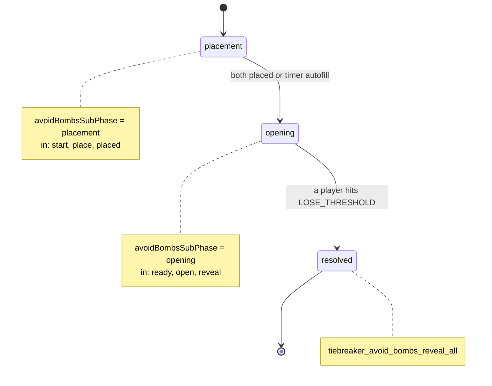
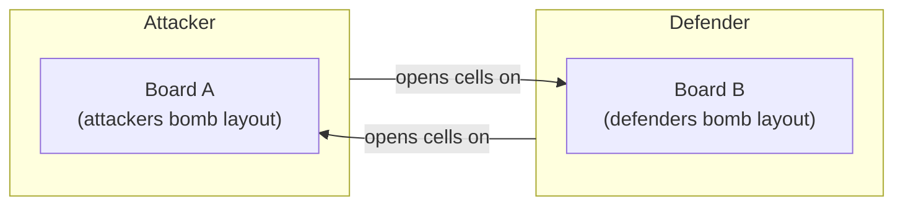
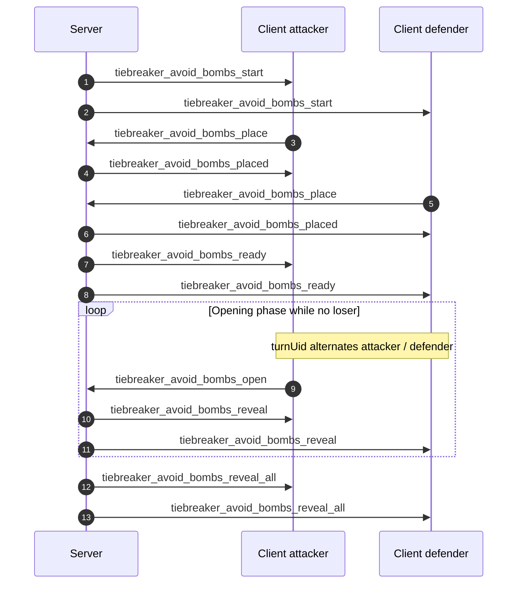
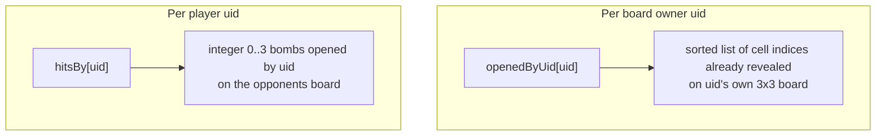

# Avoid-bombs tie-break (`minigame_avoid_bombs`)

Audience: backend and Marefa client developers working on battle tie-breaks.

## TL;DR

- **Ruleset / strategy id:** `minigame_avoid_bombs` (`TieBreakerModeIds.MINIGAME_AVOID_BOMBS`).
- **Duel flag:** `activeDuel.tiebreakKind === "avoid_bombs"` during the minigame.
- **Grid:** 3×3 (`AvoidBombsBoardRules.GRID_SIZE = 9`, indices `0..8`).
- **Placement:** each player hides **exactly `BOMB_COUNT` bombs** on **their own** board. **`BOMB_COUNT` is 3** (`AvoidBombsBoardRules.BOMB_COUNT`). Layout must be three distinct cell indices.
- **Opening:** players **alternate** revealing cells on the **opponent’s** board. If you reveal a bomb, your **personal** hit counter increases. **First player to reach `LOSE_THRESHOLD` opened bombs (3) loses** the duel.
- **Wire:** Socket.IO events prefixed with `tiebreaker_avoid_bombs_*` (see below).

## Diagrams

### Cell indices (row-major, `0..8`)

Same mapping the server uses for `cells`, `cellIndex`, and `openedByUid` lists:

```text
+---+---+---+
| 0 | 1 | 2 |
+---+---+---+
| 3 | 4 | 5 |
+---+---+---+
| 6 | 7 | 8 |
+---+---+---+
```

### Sub-phase state (server)



### Who acts on which board

Each player hides bombs on **their own** grid. During **opening**, the current player (`turnUid`) picks a cell **only on the opponent's** grid (`targetUid` is the other duelist).



### Typical socket sequence (abbreviated)



### `hitsBy` vs `openedByUid` (two different maps)



## Game flow

| Sub-phase | Server (`DuelState`) | Client UX |
|-----------|----------------------|-----------|
| Placement | `avoidBombsSubPhase = "placement"` | Pick exactly 3 cells, submit before timer |
| Opening | `avoidBombsSubPhase = "opening"` | On your turn, tap one cell on opponent grid |
| Resolved | Duel outcome applied | Full bomb layouts shown |

If placement time expires (`GameRuntimeConfig.avoidBombsPlacementMs`, default 15s), unfilled boards are **random-filled** server-side (`AvoidBombsBoardRules.randomLayout`).

## Authoritative constants (backend)

| Constant | Value | Role |
|----------|-------|------|
| `GRID_SIZE` | 9 | Cells per board |
| `BOMB_COUNT` | **3** | Bombs placed per player; bombs you must open on opponent to lose |
| `LOSE_THRESHOLD` | 3 (`BOMB_COUNT`) | Hits ending the minigame |

Payload field `bombCount` in the start event mirrors `BOMB_COUNT`; clients should cap placement selection using this value.

## Socket contract

### Client → server

| Event | Payload | Notes |
|-------|---------|------|
| `tiebreaker_avoid_bombs_place` | `{ roomId, cells: number[] }` | **`cells.length` must be `BOMB_COUNT`**, distinct indices in `0..8` |
| `tiebreaker_avoid_bombs_open` | `{ roomId, cellIndex: number }` | Target is implied (opponent’s board); must be current `turnUid` |

### Server → client

| Event | When |
|-------|------|
| `tiebreaker_avoid_bombs_start` | Placement window opens |
| `tiebreaker_avoid_bombs_placed` | Ack to placer only (`uid`, `bombCells`) |
| `tiebreaker_avoid_bombs_ready` | Both placed; opening phase; includes `turnUid`, `openedByUid`, `hitsBy` |
| `tiebreaker_avoid_bombs_reveal` | After each cell open |
| `tiebreaker_avoid_bombs_reveal_all` | Duel settled; full `bombsByUid` |
| `tiebreaker_avoid_bombs_invalid` | `{ reason }` — bad phase, bad layout, wrong turn, etc. |

### Payload highlights (`AvoidBombsTieBreakPayloadFactory`)

- **`openedByUid`:** map `playerUid → number[]`. Each value is the list of **cell indices already opened on that player’s board** (not a raw 9-bit mask as nine integers).
- **`hitsBy`:** map `playerUid → number` — how many bombs **that player has opened on the opponent’s board** (their loss counter).
- **`bombsByUid`** (reveal-all): map `playerUid → bomb cell indices`.
- **`turnUid`:** who may send `tiebreaker_avoid_bombs_open`.

## Code map

| Area | Location |
|------|----------|
| Rules | [`AvoidBombsBoardRules.java`](../src/main/java/com/sok/backend/domain/game/tiebreaker/AvoidBombsBoardRules.java) |
| Payloads | [`AvoidBombsTieBreakPayloadFactory.java`](../src/main/java/com/sok/backend/domain/game/tiebreaker/AvoidBombsTieBreakPayloadFactory.java) |
| Interaction | [`AvoidBombsTieBreakInteractionService.java`](../src/main/java/com/sok/backend/domain/game/tiebreaker/AvoidBombsTieBreakInteractionService.java) |
| Strategy / timer | [`AvoidBombsTieBreakerAttackPhaseStrategy.java`](../src/main/java/com/sok/backend/domain/game/tiebreaker/AvoidBombsTieBreakerAttackPhaseStrategy.java) |
| Gateway | [`SocketGateway.java`](../src/main/java/com/sok/backend/realtime/SocketGateway.java) (`tiebreaker_avoid_bombs_place`, `tiebreaker_avoid_bombs_open`) |
| Config | [`GameRuntimeConfig.java`](../src/main/java/com/sok/backend/service/config/GameRuntimeConfig.java) (`avoidBombsPlacementMs`) |

## Related docs

- [`GAME_MODE_ENGINE.md`](./GAME_MODE_ENGINE.md) — pluggable modes and tie-break extension point.
- [`SOCKET_PROTOCOL.md`](./SOCKET_PROTOCOL.md) — full socket catalogue (if listed there, keep in sync).
