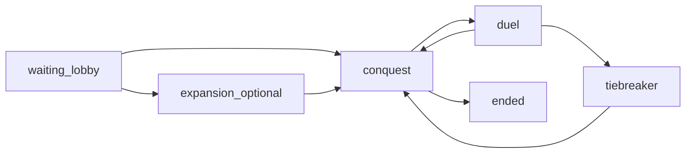

# Game flow: how the client socket interacts with the server

This document describes **lifecycle and sequencing**. For every event name and payload field, see [SOCKET_PROTOCOL.md](./SOCKET_PROTOCOL.md).

## Golden rules

1. **Subscribe once to `room_update`** and treat **`payload` / `MatchState`** (or your DTO mirroring it) as the authoritative game state after every transition.
2. **Named events** (`game_start`, `duel_start`, `expansion_round_start`, …) are **hints** for UX (sound, modals, animations). If they disagree with `room_update`, trust **`room_update`**.
3. **Always include `roomId` and `uid`** on client→server actions that mutate play state, matching the ids from the last `room_update`.
4. Sockets carry **no separate auth** today: REST uses Firebase Bearer tokens; game actions trust **`uid`** in payloads (integrators should bind socket usage to the same identity as REST).

## High-level phases

- **Expansion** runs only when the server starts with `ENABLE_GAME_EXPANSION=1` (or `true`). Otherwise **`waiting` → `conquest`** directly.
- **Tiebreaker** appears when a duel resolves as a **tie** (both wrong or both correct per server rules in `attachGameServer`).
- **Winner** is declared when one player remains with capital; server emits **`game_ended`** and sets `phase: ended`.

## 1. Connect and lobby

| Step | Client | Server |
|------|--------|--------|
| Open transport | `io(serverUrl, { reconnection: true })` | Accepts handshake (see rate limit middleware). |
| Join queue / room | **`join_matchmaking`** `{ uid, name, privateCode? }` | Matches private code or public queue; may create room; **`socket.join(roomId)`**. |
| State broadcast | — | **`room_update`** with `phase: waiting`, players, `inviteCode`, `hostUid`, map stub. |
| Public auto-start | — | When `!inviteCode` and player count ≥ 2, server may call internal start → next section. |
| Private start | **`start_match`** `{ roomId, uid }` (host only) | Same internal start when 2–4 players. |
| Leave waiting | **`leave_matchmaking`** `{ uid }` | Removes from waiting room; **`room_update`** to others. |
| Reconnect same user | **`join_matchmaking`** again with same `uid` | Rebinds `socketId`; **`room_update`** (+ **`game_start`** if already in `conquest` / `expansion`). |

Errors: **`join_rejected`** (e.g. room full) to that socket only.

## 2. Match start (server-driven)

| Step | Client | Server |
|------|--------|--------|
| Transition | — | `phase` becomes `expansion` or `conquest`; map and capitals initialized. |
| Notify playable | — | **`game_start`** + **`room_update`** (often in that order). |

Client UI should switch from lobby to **board** when `room.phase !== 'waiting'` on **`room_update`**.

## 3. Expansion phase (optional)

Only if `phase === 'expansion'` and `room.expansion` exists.

| Step | Client | Server |
|------|--------|--------|
| Question round | — | **`expansion_round_start`** (question text, timers) + **`room_update`**. |
| Submit estimate | **`expansion_submit_number`** `{ roomId, uid, value }` | Stores answer; when all alive players answered or timer fires → resolve. |
| Pick phase | — | **`expansion_pick_phase`** `{ room, pickQueue, rankings }` + **`room_update`**. |
| Claim hex | **`expansion_pick_hex`** `{ roomId, uid, hexId }` | Validates; **`expansion_pick_invalid`** to socket on failure; **`room_update`** on success. |
| End expansion | — | After max rounds: **`expansion_complete`** `{ room }` + **`game_start`** + **`room_update`**; `phase` → `conquest`. |

## 4. Conquest (main map)

| Step | Client | Server |
|------|--------|--------|
| Turn / map | Drive UI from **`room_update`**: `currentTurnIndex`, `mapState`, `attacksRemainingThisRound`, `battleRound`, scores. |
| Attack | **`attack`** `{ roomId, attackerUid, targetHexId, category? }` | Validates adjacency / turn; **`attack_invalid`** or **`attack_blocked`**; may start duel → **`duel_start`** + **`room_update`**. |
| Chat | **`room_chat`** `{ roomId, uid, name, message }` | Broadcast **`room_chat`** (sanitized). |
| Power-ups | **`use_powerup`** `{ roomId, uid, powerupType, targetHexId? }` | May emit **`duel_options_update`**, **`duel_audience_hint`**, **`duel_safety_locked`**, **`duel_spyglass_hint`** during duels; **`room_update`** when map changes. |

## 5. Duel

| Step | Client | Server |
|------|--------|--------|
| Open duel UI | Listen **`duel_start`**; confirm with **`room.activeDuel`** on **`room_update`**. | Question shown; correct answer may be hidden until resolve per server rules. |
| Answer | **`submit_answer`** `{ roomId, uid, answerIndex }` | Timer + resolution logic; auto-fill missing answers on deadline. |
| Resolve | — | **`duel_resolved`** `{ room, result }` + **`room_update`**; `phase` usually returns to **`conquest`**, or → **tiebreaker** if `result.tieBreak`. |
| Advance turn | — | Reflected on **`room_update`** (`attacksRemainingThisRound`, `currentTurnIndex`, etc.). |

## 6. Tiebreaker (duel tie)

| Step | Client | Server |
|------|--------|--------|
| Enter | — | **`tiebreaker_started`** `{ games, tieBreaker }` + **`room_update`** (`phase: tiebreaker`). |
| Vote minigame | **`tiebreaker_vote`** `{ roomId, uid, gameId }` | Votes tallied; **`tiebreaker_pick_result`** + **`room_update`**. |
| Start minigame | — | **`tiebreaker_game_start`** `{ gameId, tieBreaker }` + **`room_update`**. |
| Minefield | **`tiebreaker_minefield_place`**, **`tiebreaker_minefield_step`** | **`tiebreaker_minefield_ready`** when play starts. |
| Rhythm | **`tiebreaker_rhythm_submit`** `{ sequence }` | **`tiebreaker_rhythm_error`** to socket on bad payload; on round advance: **`room_update`** then **`tiebreaker_rhythm_next`** `{ pattern }`. |
| RPS | **`tiebreaker_rps_submit`** `{ pick }` | **`tiebreaker_rps_round`**; if match completes, brief delay then duel outcome applied (see server). |
| Closest | **`tiebreaker_closest_submit`** `{ value }` | **`tiebreaker_closest_reveal`**, then finish. |
| Finish | — | **`duel_resolved`** (often with tie-break flags) + **`room_update`**; **`phase`** back to **`conquest`**; check **capital elimination** and **`game_ended`**. |

Minigame rules and steps are enforced in [apps/server/server/tieBreaker.ts](../apps/server/server/tieBreaker.ts); client payloads must stay in sync with [SOCKET_PROTOCOL.md](./SOCKET_PROTOCOL.md).

## 7. Game over

| Step | Client | Server |
|------|--------|--------|
| Terminal state | — | **`game_ended`** `{ winnerUid, rankings, room }`; final **`room_update`** with `phase: ended`. |
| Persistence | — | Server triggers async settlement (e.g. Postgres); client can drop socket or keep for another **`join_matchmaking`**. |

## Related docs

- [SOCKET_PROTOCOL.md](./SOCKET_PROTOCOL.md) — full event list.
- [REST_API.md](./REST_API.md) — profile / shop (outside socket loop).
- [NEW_CLIENT_CHECKLIST.md](./NEW_CLIENT_CHECKLIST.md) — integration order.
- [UI_COMPONENTS.md](./UI_COMPONENTS.md) — which React screens bind to which events.
