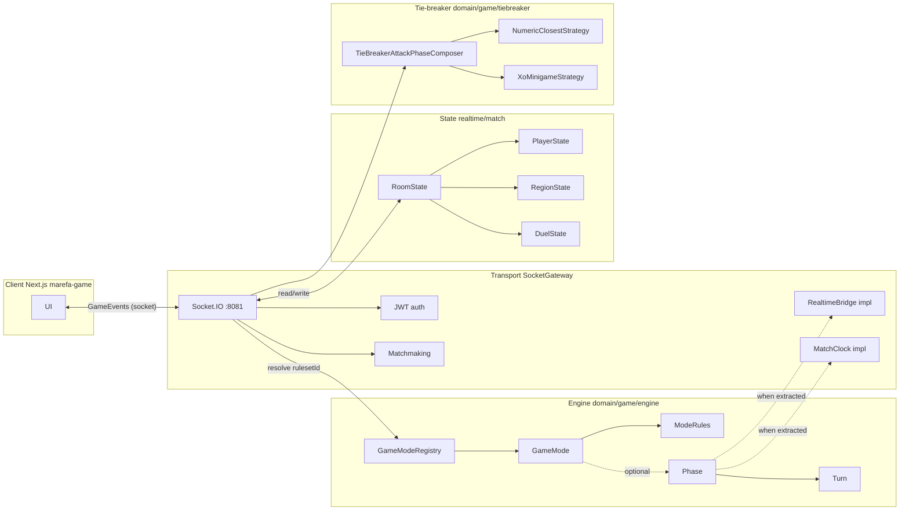
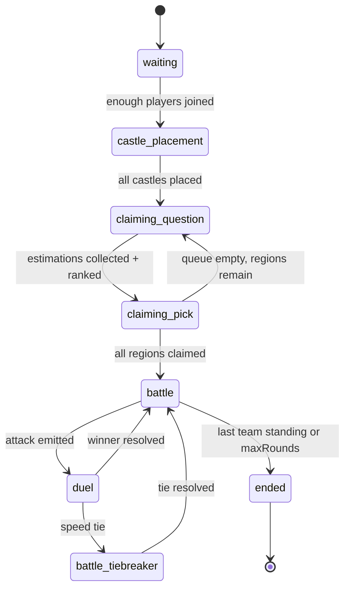
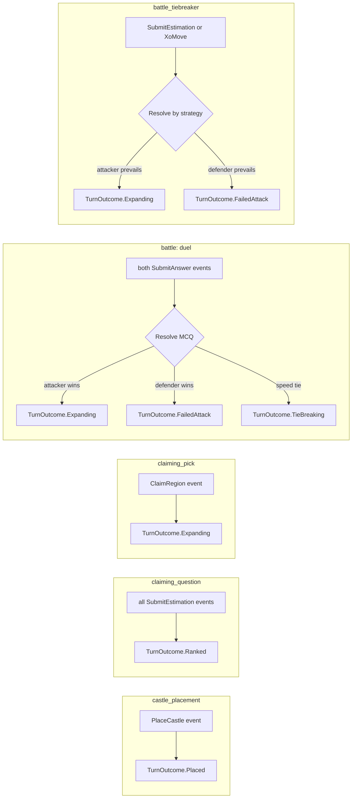
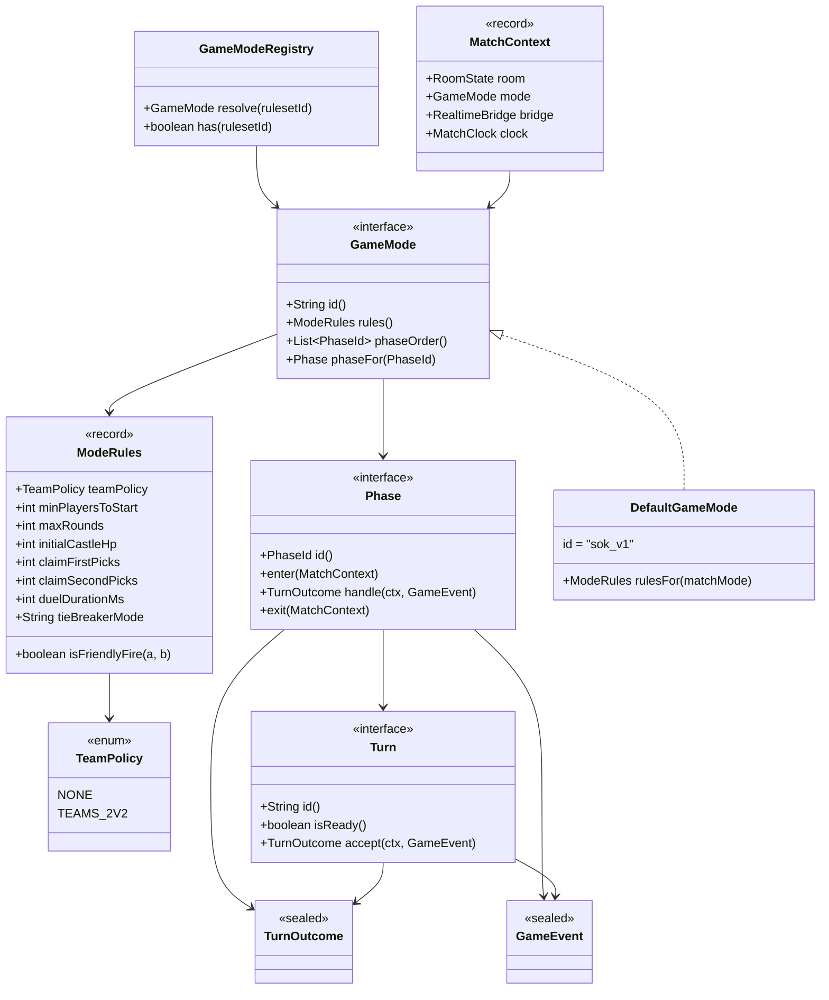
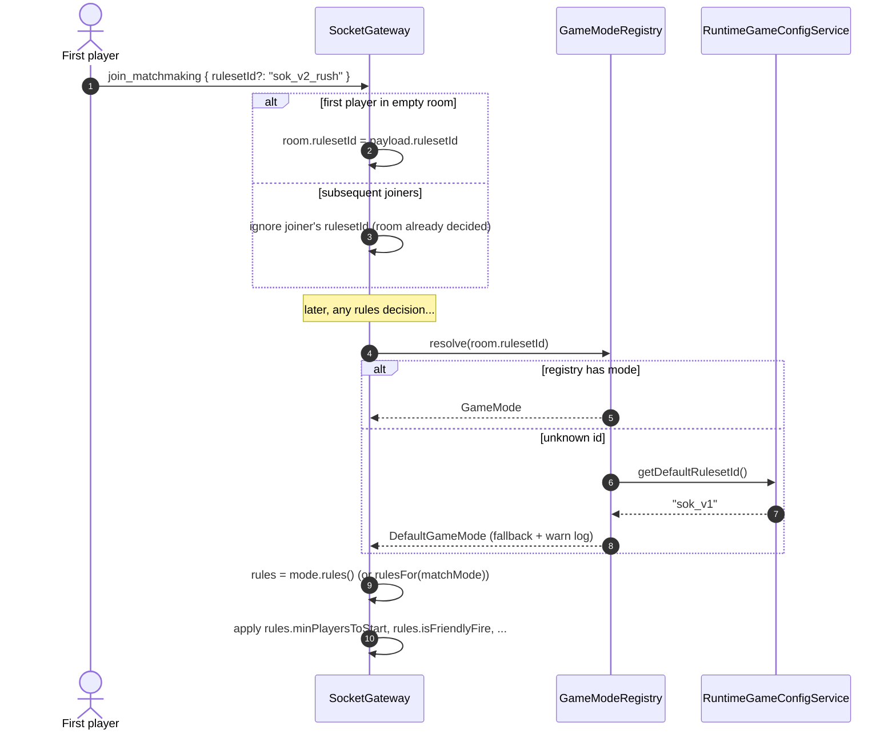
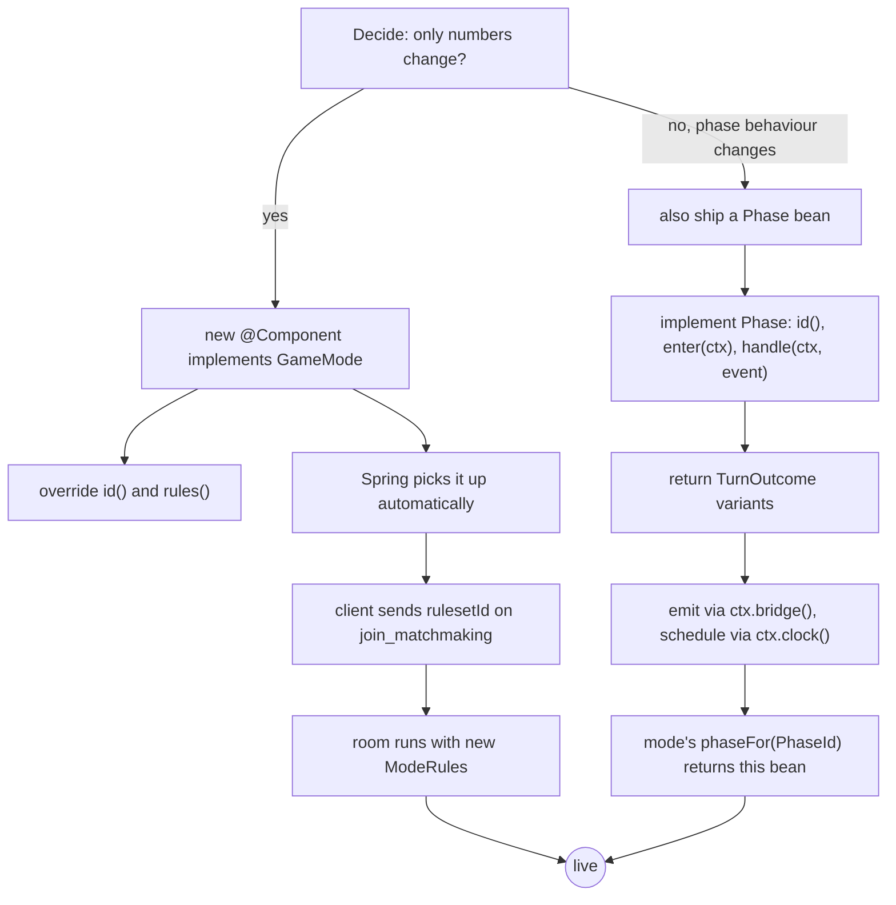
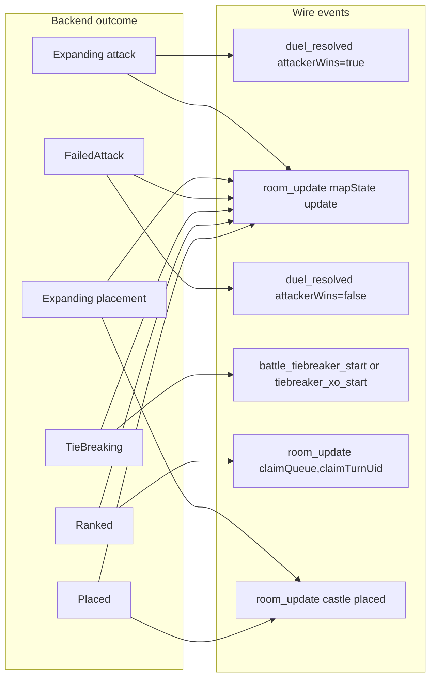
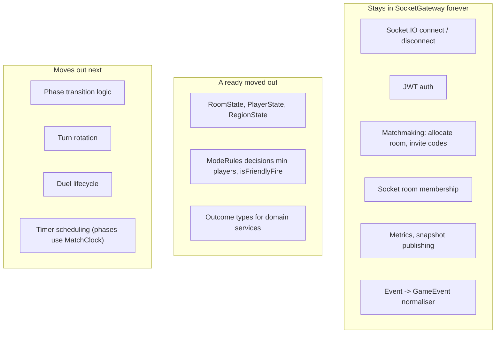
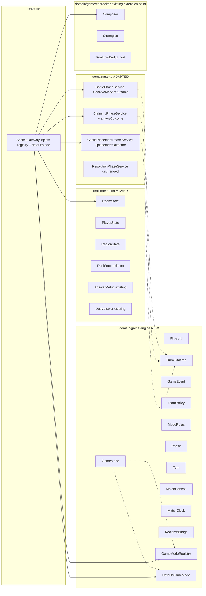

# Game Mode Engine — visual tour

Companion to [`GAME_MODE_ENGINE.md`](./GAME_MODE_ENGINE.md). This doc is heavy on
diagrams and light on prose. Read this first when onboarding; dive into the
reference doc when you need field names.

---

## 1. The big picture



Green path today: `Socket → Gateway → RoomState` with `GameModeRegistry` answering
"which rules?". Dotted lines are the wiring that lights up as each phase gets
extracted into a `Phase` bean.

---

## 2. Phase flow (unchanged from before)



These state names are exactly what the client reads on `room_update.phase`.

---

## 3. Per-phase turn resolution → outcome



Your three first-class outcomes (`Expanding`, `FailedAttack`, `TieBreaking`) sit in
the attack lane. `Placed` and `Ranked` keep the other phases honest instead of
forcing them into the attack vocabulary.

---

## 4. Type relationships



---

## 5. Attack sequence (where the three outcomes live)

```mermaid
sequenceDiagram
  autonumber
  actor A as Attacker
  actor D as Defender
  participant G as SocketGateway
  participant R as GameModeRegistry
  participant B as BattlePhaseService
  participant Tb as TieBreakerComposer

  A->>G: attack { targetHexId }
  G->>R: resolve(room.rulesetId)
  R-->>G: GameMode (sok_v1)
  G->>G: sameTeam? via ModeRules.isFriendlyFire
  G-->>A: attack_invalid (ally_territory) if same team
  G->>A: duel_start (MCQ)
  G->>D: duel_start (MCQ)
  A->>G: submit_answer
  D->>G: submit_answer
  G->>B: resolveMcqAsOutcome(...)
  alt attacker correct, defender wrong or slower
    B-->>G: TurnOutcome.Expanding(attacker, region, hp-1)
    G->>G: transfer region, damage HP
    G-->>A: duel_resolved attackerWins=true
    G-->>D: duel_resolved attackerWins=true
  else defender correct and attacker wrong or slower
    B-->>G: TurnOutcome.FailedAttack(attacker, defender)
    G-->>A: duel_resolved attackerWins=false
    G-->>D: duel_resolved attackerWins=false
  else both correct, same latency
    B-->>G: TurnOutcome.TieBreaking("mcq_speed_tie", strategyId)
    G->>Tb: composer.resolve(mode, defender)
    Tb-->>G: NumericClosest or Xo strategy
    G->>A: battle_tiebreaker_start
    G->>D: battle_tiebreaker_start
  end
```



---

## 6. Mode selection on join



---

## 7. Adding a new mode (developer flow)



No file in `SocketGateway` edited for either branch.

---

## 8. Wire protocol: what the client sees per outcome



No new event names on the wire. The client's existing handlers stay valid.

---

## 9. Boundary: what lives where



---

## 10. File map



---

## 11. Minimal example: the Rush mode in 20 lines

```java
@Component
public class RushMode implements GameMode {
  @Override public String id() { return "sok_v2_rush"; }

  @Override public String displayName() { return "Rush"; }

  @Override public ModeRules rules() {
    return new ModeRules(
        TeamPolicy.NONE,
        /* minPlayersToStart */ 2,
        /* maxPlayers        */ 6,
        /* maxRounds         */ 8,
        /* initialCastleHp   */ 2,
        /* claimFirstPicks   */ 1,
        /* claimSecondPicks  */ 1,
        /* duelDurationMs    */ 6000,
        /* claimDurationMs   */ 10000,
        /* tiebreakDurationMs*/ 6000,
        /* tieBreakerMode    */ "attacker_advantage",
        /* maxMcqTieRetries  */ 0,
        /* xoDrawMaxReplay   */ 0);
  }
}
```

Result:

1. Spring discovers the bean on startup.
2. `GameModeRegistry` logs `mode(s): [sok_v1, sok_v2_rush]`.
3. Any room with `rulesetId = "sok_v2_rush"` starts with two players, attackers
   always win ties, timers are shorter. Other modes still run unchanged.

No line of `SocketGateway` was modified.
