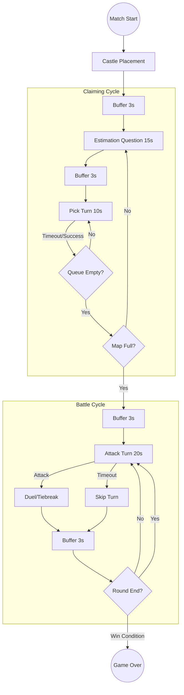
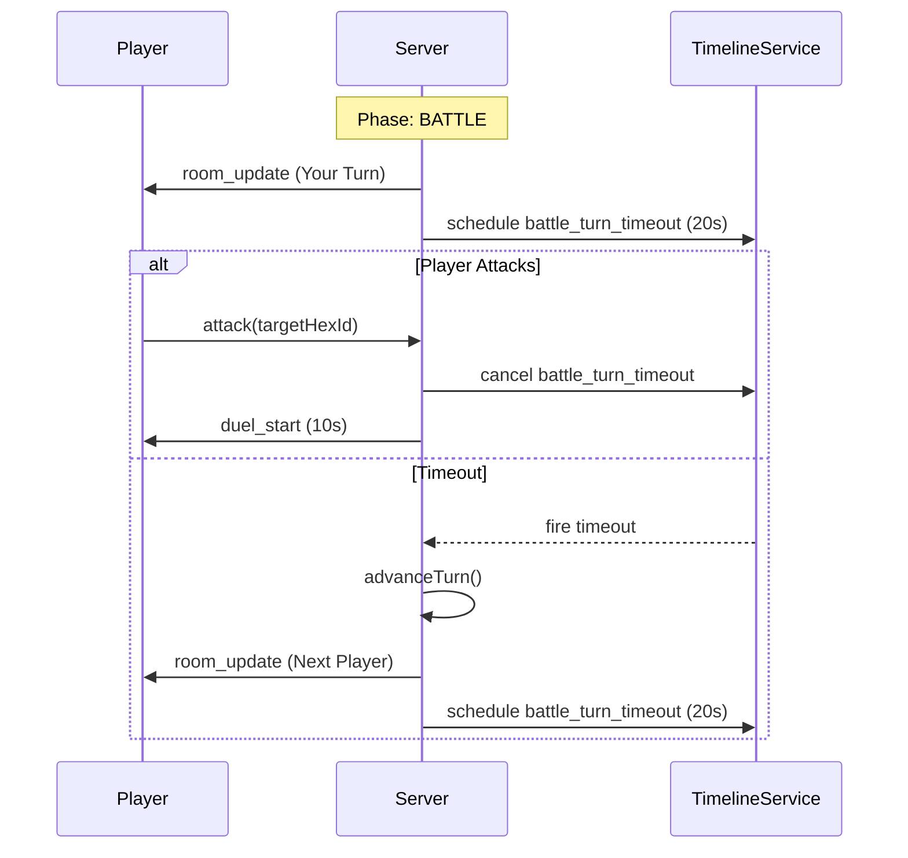

# ⏳ Sword of Knowledge: Game Timeline

This document explains how the server manages time, animations, and turn-based interactions using the `GameTimelineService`.

## ⚙️ Configuration
Located in `GameRuntimeConfig.java`. These values ensure the server stays in sync with frontend animations.

| Property | Value | Role |
| :--- | :--- | :--- |
| `phaseAnimationBufferMs` | 3000ms | Pause between phases for "Round Start" UI. |
| `estimationTurnMs` | 15000ms | Window for all players to answer the numeric question. |
| `claimPickTurnMs` | 10000ms | Individual time per player to pick a hex. |
| `battleAttackTurnMs` | 20000ms | Individual time to select an adjacent target. |
| `duelMcqMs` | 10000ms | Time allowed to answer a battle question. |
| `minigameMoveTurnMs` | 15000ms | Time per move in tie-breakers (e.g., Avoid Bombs). |

---

## 🗺️ Game Flow Diagram

---

## ⏱️ Per-Turn Logic Deep Dive

Unlike the previous version which used "Phase Timers", the new system uses **Action-Specific Timers**.

### ⚔️ Battle Turn Sequence
This ensures that a single AFK player cannot stall the entire match.

### 💣 Tie-Breaker (Avoid Bombs)
Every move is now precision-timed to keep the minigame snappy.

1.  **Placement:** Both players have `avoidBombsPlacementMs`.
2.  **Move Timer:** Once opening begins, the active player has `minigameMoveTurnMs`.
3.  **Handoff:** On a successful "Open", the timer is cancelled and reset for the next player.

---

## 🏛️ Best Practices Applied
1.  **Centralization:** All timers go through `GameTimelineService`. No more `new Timer()` or `Thread.sleep` scattered in controllers.
2.  **Concurrency:** Every timer task is wrapped in `executors.submitToRoom`, ensuring that state changes only happen on the safe room-thread.
3.  **Safety:** `cancelTurnTimeout` is called aggressively before starting any new timer to prevent "Double Advancement" bugs.
