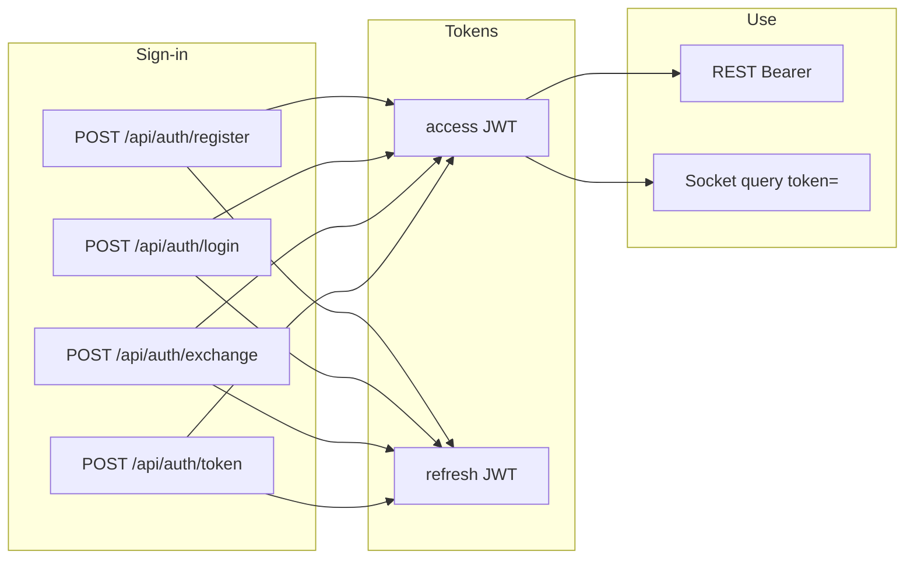

# New client integration (deep dive): REST auth → profile → Socket.IO matchmaking

This document is the **end-to-end client contract** for the Spring backend: how to obtain **one kind of JWT** (access + refresh), bootstrap **profile**, open **Socket.IO**, and drive **matchmaking / play**. It includes **sample HTTP requests and responses** aligned with `AuthController`, `ProfileController`, and `SocketGateway`.

**TL;DR**

1. Get tokens: **`POST /api/auth/register`** or **`/login`** (email) or **`/exchange`** (Firebase) — same JSON shape every time.
2. Store **`accessToken`** + **`refreshToken`**; REST uses `Authorization: Bearer <accessToken>`.
3. Socket connects to **port 8081**, path **`/socket.io`**, query **`token=<accessToken>`** (not the Firebase ID token in prod).
4. After connect, emit **`join_matchmaking`** with **`uid` = JWT `sub`** (decode access JWT or read from your login response flow).
5. Treat **`room_update`** as truth; phase names match the **Spring** server (`castle_placement`, …) — not the legacy Node flow in `docs/GAME_FLOW.md`.
6. Full match rules: **[game-flow-deep-dive.md](./spring/game-flow-deep-dive.md)**.

**Who reads what**

| You are building… | Read first |
|-------------------|------------|
| Auth + REST only | §0–§8, §11, then [PublicApiPaths](../src/main/java/com/sok/backend/config/PublicApiPaths.java) if you add routes |
| Realtime game client | §9 here, then **entire** [game-flow-deep-dive.md](./spring/game-flow-deep-dive.md), then [03-socket-protocol.md](./spring/03-socket-protocol.md) |
| Google-only sign-in | §4, §6.2, §5 if you later add email accounts |

**Table of contents** — [§0 Topology](#0-topology-and-assumptions) · [§1 JWT model](#1-mental-model-one-jwt-family-many-sign-in-paths) · [§2 Token envelope](#2-shared-success-envelope-tokens) · [§3 Register / login](#3-primary-register-and-login-email--password) · [§4 Firebase](#4-secondary-firebase-id-token-exchange) · [§5 Link](#5-link-firebase-to-the-logged-in-email-user) · [§6 `/token`](#6-unified-token-endpoint-multi-provider) · [§7 Refresh / logout](#7-session-lifecycle-refresh-and-logout) · [§8 Profile](#8-profile-bootstrap-authenticated-rest) · [§9 Socket](#9-socketio-connect-auth-matchmaking) · [§10 E2E](#10-end-to-end-sequence-recommended) · [§11 Prod](#11-production-checklist) · [§12 Pitfalls](#12-common-pitfalls) · [§13 Links](#13-further-reading)

---

## 0. Topology and assumptions

| Surface | Default (local) | Config keys |
|--------|-------------------|---------------|
| REST API | `http://<host>:8080` | `server.port` → env `PORT` |
| Socket.IO | `http://<host>:8081` | `app.socket.port` in `application.yml` → env **`SOCKET_PORT`** |
| Socket path | **`/socket.io`** | Fixed in `SocketIoConfig` |

### REST quick reference

All paths are under the host above. **Auth:** unless noted, endpoints are **public** (no Bearer). Profile requires Bearer.

| Method | Path | Auth | Purpose |
|--------|------|------|---------|
| `POST` | `/api/auth/register` | — | Create email user + tokens (`201`) |
| `POST` | `/api/auth/login` | — | Email login + tokens (`200`) |
| `POST` | `/api/auth/exchange` | — | Firebase ID token → tokens (`200`) |
| `POST` | `/api/auth/token` | — | Grant-based login (`password` / `google_firebase_id_token`) |
| `POST` | `/api/auth/link/firebase` | **Bearer** | Attach Google identity to current user (`200`) |
| `POST` | `/api/auth/refresh` | — | Rotate refresh → new pair (`200`) |
| `POST` | `/api/auth/logout` | — | Revoke session (`200`, body `ok`) |
| `GET` | `/api/profile` | **Bearer** | Load profile (`404` if missing row — rare after register) |
| `POST` | `/api/profile` | **Bearer** | Create / ensure profile (`201`) |

There is **no** `/api/v1` prefix: public routes live under `/api/...` as implemented.

**Production:** terminate TLS in front of the app; use `https://` / `wss://` to the same logical host (or a gateway that forwards to `PORT` and `SOCKET_PORT`).

**Verified in CI:** `mvn test` exercises HTTP pieces (`NewClientPathAuthMvcTest`, `NewClientPathProfileMvcTest`, `AuthLinkFirebaseMvcTest`). Socket behaviour should still be smoke-tested against a running server.

---

## 1. Mental model: one JWT family, many sign-in paths

All successful sign-in paths return the **same JSON shape** (`accessToken`, `refreshToken`, `tokenType`). The **access token** is a self-contained JWT (HS256 in `LocalJwtService`) whose payload includes at least:

| Claim | Meaning |
|-------|---------|
| `sub` | Canonical **user id** for the whole product (REST, sockets, `room_update` `uid`). Either a **UUID** (email/password account) or **Firebase UID** (Google-only until linked). |
| `typ` | `"access"` or `"refresh"` (refresh tokens must not be sent as Bearer access). |
| `sid` | Auth session id (UUID string), used server-side with refresh rotation. |
| `iss` | Issuer from `app.auth.issuer` (default `sok-local-auth`). |
| `iat` / `exp` | Unix seconds. Access TTL: `app.auth.access-ttl-seconds` (default 900). Refresh TTL: `app.auth.refresh-ttl-seconds`. |

**Primary identity:** email + password (`/api/auth/register`, `/api/auth/login`).  
**Secondary:** Firebase Auth ID token (`/api/auth/exchange` or token grant `google_firebase_id_token`).  
**Linking:** while logged in with a **password** session, `POST /api/auth/link/firebase` binds a Google account to that user so future Google sign-in issues JWTs with the **same** `sub` as the email account.



---

## 2. Shared success envelope (tokens)

Any endpoint that issues a session returns **JSON** like:

```json
{
  "accessToken": "<jwt-access>",
  "refreshToken": "<jwt-refresh>",
  "tokenType": "Bearer"
}
```

**Client rules**

1. Send **`Authorization: Bearer <accessToken>`** on protected REST routes.
2. When access is near expiry (or after `401`), call **`POST /api/auth/refresh`** with the refresh token (see §4).
3. For Socket.IO handshake, pass **`token=<accessToken>`** in the query string (not the Firebase ID token in production; see `ALLOW_INSECURE_SOCKET` in `application.yml`).

---

## 3. Primary: register and login (email / password)

### 3.1 `POST /api/auth/register`

Creates a `users` row with a **server-generated UUID** `id`, stores **normalized email** (trim + lower case) and **bcrypt** `password_hash`. Returns **`201 Created`** with tokens.

**Sample request**

```http
POST /api/auth/register HTTP/1.1
Host: localhost:8080
Content-Type: application/json

{
  "email": "Ada@Example.com",
  "password": "hunter2!!",
  "displayName": "Ada",
  "deviceInfo": "ios 17 / app 1.4.0"
}
```

**Sample success (`201`)**

```json
{
  "accessToken": "eyJhbGciOiJIUzI1NiIsInR5cCI6IkpXVCJ9.eyJzdWIiOiJhMWIyYzNkNC1lNWY2LTc4OTAtYWJjZC1lZjEyMzQ1Njc4OTAiLCJ0eXAiOiJhY2Nlc3MiLCJzaWQiOiIuLi4ifQ....",
  "refreshToken": "eyJhbGciOiJIUzI1NiIsInR5cCI6IkpXVCJ9.eyJzdWIiOiJhMWIyYzNkNC1lNWY2LTc4OTAtYWJjZC1lZjEyMzQ1Njc4OTAiLCJ0eXAiOiJyZWZyZXNoIiwic2lkIjoiLi4uIn0....",
  "tokenType": "Bearer"
}
```

The access JWT `sub` is the **UUID** string (example above is illustrative). Use that value everywhere the server expects **`uid`**.

**Sample errors**

| Status | Body | When |
|--------|------|------|
| `400` | `{"error":"email and password are required"}` | Missing email or password |
| `400` | `{"error":"invalid_email"}` | Email failed server-side validation |
| `400` | `{"error":"weak_password"}` | Password shorter than 8 or longer than 128 |
| `409` | `{"error":"email_taken"}` | Email already registered (unique index) |
| `429` | `{"error":"rate_limited"}` | Per-IP register budget exceeded |

**curl**

```bash
curl -sS -X POST "http://localhost:8080/api/auth/register" \
  -H "Content-Type: application/json" \
  -d '{"email":"ada@example.com","password":"hunter2!!","displayName":"Ada"}'
```

---

### 3.2 `POST /api/auth/login`

**Sample request**

```http
POST /api/auth/login HTTP/1.1
Host: localhost:8080
Content-Type: application/json

{
  "email": "ada@example.com",
  "password": "hunter2!!",
  "deviceInfo": "web"
}
```

**Sample success (`200`)** — same envelope as register (`accessToken`, `refreshToken`, `tokenType`).

**Sample errors**

| Status | Body |
|--------|------|
| `400` | `{"error":"email and password are required"}` |
| `401` | `{"error":"Invalid credentials"}` (wrong email/password, or non-password account) |
| `429` | `{"error":"rate_limited"}` |

**curl**

```bash
curl -sS -X POST "http://localhost:8080/api/auth/login" \
  -H "Content-Type: application/json" \
  -d '{"email":"ada@example.com","password":"hunter2!!"}'
```

---

## 4. Secondary: Firebase ID token exchange

Client obtains a Firebase ID token (e.g. `getIdToken()` after Google sign-in). Server verifies the JWT against Google certs (`FIREBASE_PROJECT_ID` / `app.firebase.project-id`).

### 4.1 `POST /api/auth/exchange`

**Sample request**

```http
POST /api/auth/exchange HTTP/1.1
Host: localhost:8080
Content-Type: application/json

{
  "idToken": "<firebase_id_token_jwt>",
  "deviceInfo": "android"
}
```

**Sample success (`200`)** — token envelope as in §2.

- **Google-only user (never linked):** access JWT `sub` equals **Firebase UID**.
- **After linking** (§5): same call returns tokens whose `sub` is the **email user UUID** (canonical row).

**Sample errors**

| Status | Body | When |
|--------|------|------|
| `400` | `{"error":"idToken is required"}` | Empty / missing body field |
| `401` | `{"error":"Invalid token"}` | Signature / exp / aud / iss mismatch |
| `503` | `{"error":"identity_not_configured"}` | Firebase project id not set |
| `503` | `{"error":"identity_keys_unavailable"}` | Google cert fetch failed |
| `429` | `{"error":"rate_limited"}` | Per-IP exchange budget |

**curl**

```bash
curl -sS -X POST "http://localhost:8080/api/auth/exchange" \
  -H "Content-Type: application/json" \
  -d "{\"idToken\":\"$FIREBASE_ID_TOKEN\"}"
```

---

## 5. Link Firebase to the logged-in email user

Call **after** `login` / `register` so you have a **Bearer access** token for the **email** account.

### 5.1 `POST /api/auth/link/firebase`

**Headers:** `Authorization: Bearer <accessToken>`  
**Body:** Firebase ID token for the Google account to attach.

**Sample request**

```http
POST /api/auth/link/firebase HTTP/1.1
Host: localhost:8080
Authorization: Bearer <access_jwt_from_email_login>
Content-Type: application/json

{
  "idToken": "<firebase_id_token_jwt>"
}
```

**Sample success (`200`)**

```json
{
  "ok": true
}
```

After this, exchanging the **same** Firebase ID token yields access JWTs whose **`sub`** is the **email user’s UUID** (single profile / inventory / progression).

**Sample errors**

| Status | Body | When |
|--------|------|------|
| `400` | `{"error":"idToken is required"}` | Missing token |
| `401` | `{"error":"Invalid token"}` | Bad Firebase JWT |
| `401` | `{"error":"unauthorized"}` | Missing / invalid **access** Bearer (from `SecurityUtils`) |
| `409` | `{"error":"provider_already_linked"}` | This Firebase UID already maps to another user |
| `503` | `{"error":"identity_not_configured"}` | Firebase not configured |
| `429` | `{"error":"rate_limited"}` | Per-IP link budget |

**curl**

```bash
curl -sS -X POST "http://localhost:8080/api/auth/link/firebase" \
  -H "Authorization: Bearer $ACCESS" \
  -H "Content-Type: application/json" \
  -d "{\"idToken\":\"$FIREBASE_ID_TOKEN\"}"
```

---

## 6. Unified token endpoint (multi-provider)

`POST /api/auth/token` selects a provider with **`grantType`**. Same token envelope on success.

### 6.1 Password grant

**Sample request**

```http
POST /api/auth/token HTTP/1.1
Host: localhost:8080
Content-Type: application/json

{
  "grantType": "password",
  "email": "ada@example.com",
  "password": "hunter2!!",
  "deviceInfo": "cli"
}
```

**Sample success (`200`)** — §2 envelope.

**Typical errors:** `400` `grantType is required`, `unsupported_grant_type`; `401` `Invalid credentials`; `429` `rate_limited`.

### 6.2 Firebase grant

**Sample request**

```json
{
  "grantType": "google_firebase_id_token",
  "idToken": "<firebase_id_token_jwt>",
  "deviceInfo": "web"
}
```

**Typical errors:** `400` `idToken is required`; `401` `Invalid token`; `503` `identity_not_configured` / `identity_keys_unavailable` / `provider_unavailable`; `429` `rate_limited`.

**curl (password grant)**

```bash
curl -sS -X POST "http://localhost:8080/api/auth/token" \
  -H "Content-Type: application/json" \
  -d '{"grantType":"password","email":"ada@example.com","password":"hunter2!!"}'
```

---

## 7. Session lifecycle: refresh and logout

### 7.1 `POST /api/auth/refresh`

**Sample request**

```http
POST /api/auth/refresh HTTP/1.1
Host: localhost:8080
Content-Type: application/json

{
  "refreshToken": "<jwt-refresh>",
  "deviceInfo": "optional string"
}
```

**Sample success (`200`)** — new access + refresh (rotation); old refresh is invalidated server-side as part of rotation.

**Sample errors**

| Status | Body |
|--------|------|
| `400` | `{"error":"refreshToken is required"}` |
| `401` | `{"error":"unauthorized"}` (or message from `UnauthorizedException`) when refresh invalid / revoked / wrong hash |
| `429` | `{"error":"rate_limited"}` |

**curl**

```bash
curl -sS -X POST "http://localhost:8080/api/auth/refresh" \
  -H "Content-Type: application/json" \
  -d "{\"refreshToken\":\"$REFRESH\"}"
```

### 7.2 `POST /api/auth/logout`

**Sample request**

```json
{
  "refreshToken": "<jwt-refresh>"
}
```

**Sample success (`200`)**

```json
{
  "ok": true
}
```

**Sample error (`400`)**

```json
{
  "ok": false
}
```

---

## 8. Profile bootstrap (authenticated REST)

All routes require **`Authorization: Bearer <accessToken>`**. Without it, Spring Security responds with **`401`** and JSON `{"error":"Unauthorized"}` (see `LocalJwtAuthFilter` / `SecurityConfig`).

### 8.1 `GET /api/profile`

Returns the persisted user row as `ProfileResponse` fields (`uid`, `name`, `username`, `countryFlag`, `title`, `level`, `xp`, `gold`, `gems`, `avatar`, `rank`, `trophies`, `inventory`).

**Sample request**

```http
GET /api/profile HTTP/1.1
Host: localhost:8080
Authorization: Bearer <access_jwt>
```

**Sample success (`200`)** (shape illustrative; numbers come from DB defaults / migrations)

```json
{
  "uid": "a1b2c3d4-e5f6-7890-abcd-ef1234567890",
  "name": "Ada",
  "username": "ada@example.com",
  "countryFlag": "🇸🇦",
  "title": "Knowledge Knight",
  "level": 1,
  "xp": 0,
  "gold": 1000,
  "gems": 50,
  "avatar": "",
  "rank": "Bronze",
  "trophies": 0,
  "inventory": []
}
```

**Sample not provisioned (`404`)**

```json
{
  "error": "Not found"
}
```

Email **register** inserts a `users` row immediately, so **`GET /api/profile` usually returns `200`** with default stats; use **`POST /api/profile`** to set `name` / `username` / `avatar`. Google-only users get a row on first successful **`/api/auth/exchange`** (or token grant).

**curl**

```bash
curl -sS "http://localhost:8080/api/profile" \
  -H "Authorization: Bearer $ACCESS"
```

---

### 8.2 `POST /api/profile`

Creates profile data if missing for this JWT `sub`; if row already exists, returns existing (**`201`** is still returned from controller with current representation — idempotent create).

**Sample request**

```http
POST /api/profile HTTP/1.1
Host: localhost:8080
Authorization: Bearer <access_jwt>
Content-Type: application/json

{
  "name": "Ada Lovelace",
  "username": "ada",
  "avatar": "https://cdn.example/avatar.png"
}
```

**Sample success (`201`)** — same JSON shape as GET profile.

**curl**

```bash
curl -sS -X POST "http://localhost:8080/api/profile" \
  -H "Authorization: Bearer $ACCESS" \
  -H "Content-Type: application/json" \
  -d '{"name":"Ada","username":"ada"}'
```

### 8.3 `PATCH /api/profile`

Currently **`501 Not Implemented`** with body `{"error":"Not found"}` — do not rely on it.

---

## 9. Socket.IO: connect, auth, matchmaking

**Full game semantics** (phases, timers, payloads, Node-vs-Spring differences): [docs/spring/game-flow-deep-dive.md](./spring/game-flow-deep-dive.md).

### 9.1 Connect

- **URL:** `http://<host>:8081` (or `ws://` / `wss://` depending on client and TLS).
- **Path:** `/socket.io` (Socket.IO default namespace `/`).
- **Handshake query:** `token=<accessToken>` (URL-encoded JWT).

Example client URL (JavaScript client v2/v3 style):

```text
http://localhost:8081/socket.io/?token=<url_encoded_access_jwt>&EIO=4&transport=websocket
```

The server (`SocketGateway`) verifies the access JWT and stores **`uid` = `sub`** on the socket. **Mismatch** between socket uid and payload `uid` on events results in **disconnect** (`payloadHasSocketUid`).

### 9.2 `join_matchmaking`

Emit event name **`join_matchmaking`** with JSON payload:

```json
{
  "uid": "<must_equal_jwt_sub>",
  "name": "Ada",
  "privateCode": null
}
```

**Private rooms:** optional `privateCode` string. Server **strips non-alphanumeric**, **uppercases**, clips to **8** chars. A code is treated as a **private invite** only when the normalized length is **≥ 4**; otherwise you join public matchmaking.

### 9.3 Server events to subscribe to first

| Event | Role |
|-------|------|
| `room_update` | **Authoritative** room snapshot (phase, players, regions, scores, etc.). |
| `phase_changed` | UX hint when phase string changes. |
| `join_rejected` | e.g. `{"reason":"room_full"}`. |
| `duel_start`, `estimation_question`, `claim_rankings`, `battle_tiebreaker_start`, … | See `docs/spring/03-socket-protocol.md` for the flat list; **game-flow-deep-dive** for behaviour. |

**Illustrative** `room_update` fragment (field names match `SocketGateway.roomToClient`; `minPlayers` is **not** included—read it from server config / defaults, typically **3**):

```json
{
  "id": "room_1",
  "phase": "waiting",
  "round": 1,
  "currentTurnIndex": 0,
  "inviteCode": "ABCD12",
  "hostUid": "a1b2c3d4-e5f6-7890-abcd-ef1234567890",
  "players": [
    {
      "uid": "a1b2c3d4-e5f6-7890-abcd-ef1234567890",
      "name": "Ada",
      "hp": 3,
      "color": "#C41E3A",
      "isCapitalLost": false,
      "trophies": 0,
      "eliminatedAt": null,
      "castleRegionId": null,
      "online": true
    }
  ],
  "mapState": [],
  "scoreByUid": {},
  "claimTurnUid": null,
  "claimPicksLeftByUid": {}
}
```

When **`waiting`** reaches runtime **`minPlayers`** (from DB `game_runtime_config`, default **3**), the server moves to **`castle_placement`** without an extra client call. Private **waiting** rooms: **host** may emit **`start_match`** `{"roomId":"...","uid":"..."}` (use **`id`** from `room_update` as `roomId`).

### 9.4 Play-phase client emits (conceptual)

| Phase | Emit | Payload fields (all must agree with `room_update`) |
|-------|------|------------------------------------------------------|
| `castle_placement` | `place_castle` | `roomId`, `uid`, `regionId` |
| `claiming_question` | `submit_estimation` | `roomId`, `uid`, `value` |
| `claiming_pick` | `claim_region` | `roomId`, `uid`, `regionId` |
| `battle` | `attack` | `roomId`, `attackerUid`, `targetHexId` (region id from map) |
| `duel` | `submit_answer` | `roomId`, `uid`, `answerIndex` |
| `battle_tiebreaker` | `submit_estimation` | Same numeric duel as estimation (not `submit_answer`) |

Listen for **`attack_invalid`**, **`duel_resolved`**, **`game_ended`**, **`battle_tiebreaker_start`**, etc.; treat **`room_update`** as source of truth if text hints disagree.

### 9.5 Leave and reconnect

- **Leave:** emit **`leave_matchmaking`** `{ "uid": "<jwt_sub>" }`.
- **Reconnect:** obtain a fresh **`accessToken`** (refresh or sign-in again), reconnect Socket.IO with `token=...`, re-emit **`join_matchmaking`** with the same `uid` (and same `privateCode` if used).

---

## 10. End-to-end sequence (recommended)

1. **`POST /api/auth/register`** or **`/login`** (or `/exchange` / `/token`) → store `accessToken` + `refreshToken`.
2. Optionally **`POST /api/auth/link/firebase`** if the same human uses Google on device.
3. **`GET /api/profile`** → if `404`, **`POST /api/profile`** once to set display fields.
4. **Socket:** connect with `token=<accessToken>` → **`join_matchmaking`** with `uid` = JWT `sub`.
5. Drive play from **`room_update.phase`** and the table in §9.4.
6. On HTTP **`401`**, **`POST /api/auth/refresh`** then retry.

---

## 11. Production checklist

| Item | Notes |
|------|--------|
| `FIREBASE_PROJECT_ID` | Required only for Firebase exchange / token grant / link. |
| `ALLOW_INSECURE_SOCKET` | Keep **`false`**: handshake must use JWT access token, not raw `uid` query spoofing. |
| `CORS_ORIGIN` | Must include browser origins that call REST and open sockets. |
| TLS | Expose or proxy `PORT` (REST) and `SOCKET_PORT` (Socket.IO). |
| Postgres + Flyway | Required; schema includes `users`, `auth_sessions`, `user_identity_links`. |

**Orphan rows:** linking re-homes `user_identity_links` from a self-row `(firebaseUid → firebaseUid)` to `(uuid → firebaseUid)`. An old **`users`** row keyed only by Firebase UID may remain unused; plan data cleanup separately if that matters for your product.

---

## 12. Common pitfalls

| Mistake | Symptom | Fix |
|---------|---------|-----|
| Firebase ID token in Socket `token=` while `ALLOW_INSECURE_SOCKET=false` | Handshake fails / disconnect | Use **access** JWT from `/login` or `/exchange` / `/token` |
| `join_matchmaking.uid` ≠ JWT `sub` | Immediate disconnect | Decode access token or use the same string you sent to `/register` response flow |
| Using **`id`** from `room_update` as socket field name | N/A — server expects **`roomId`** on **emits** | Copy `room.id` from snapshot into JSON key **`roomId`** for `place_castle`, `attack`, etc. |
| Sending **refresh** JWT as `Authorization: Bearer` on `/api/profile` | `401` Unauthorized | Only **access** (`typ: access`) is accepted as Bearer on REST |
| Expecting **`game_start`** after lobby | Never fires on Spring | Switch UI when `room_update.phase !== "waiting"` |
| Following **`docs/GAME_FLOW.md`** literally | Wrong phases / events | That file targets **legacy Node**; use [game-flow-deep-dive.md](./spring/game-flow-deep-dive.md) |
| Relying on `minPlayers` inside `room_update` | Field absent | Read from your config UI or assume **3** until you fetch runtime config from an admin/API you add |

---

## 13. Further reading

- **`docs/spring/game-flow-deep-dive.md`** — phases, timers, duel resolution, `game_ended`, reconnect (Spring **source of truth** for gameplay).
- **`docs/spring/03-socket-protocol.md`** — flat socket event list and handshake limits.
- **Code:** `AuthController`, `AuthService`, `com.sok.backend.auth.*`, `SocketGateway`, `ProfileController`, `PublicApiPaths`.
