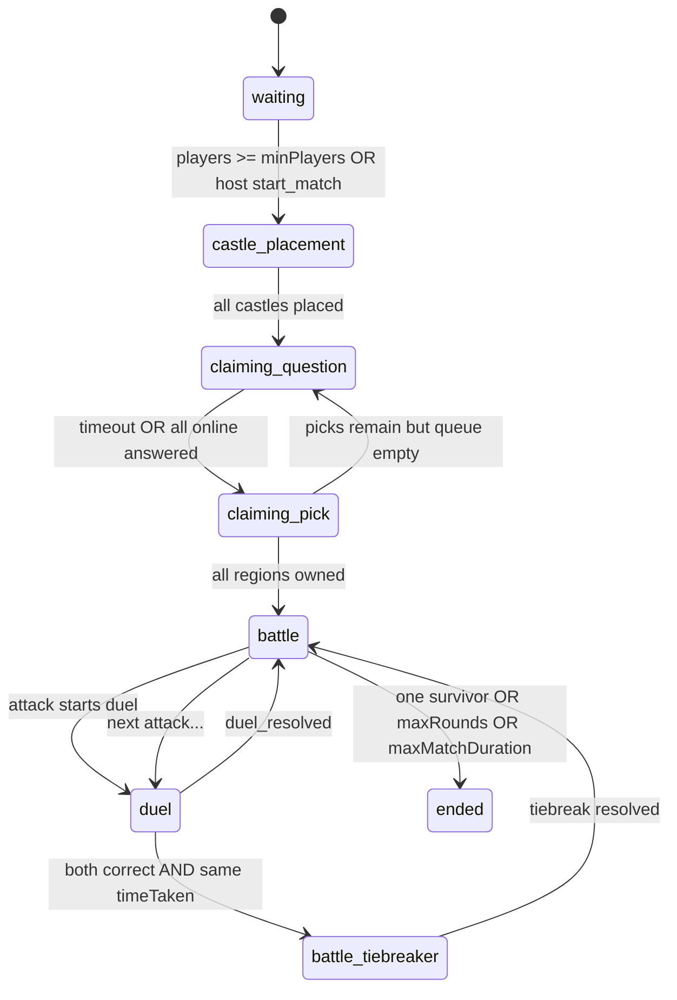

# Spring realtime game flow (deep dive)

This document matches the **Java** implementation in `SocketGateway` and related domain services. It supersedes generic socket docs that still describe the **legacy Node** stack (`conquest`, `expansion`, `game_start`, etc.): those **do not apply** to this Spring server.

**Companion docs**

- [new-client-path.md](../new-client-path.md) — obtain JWT, profile, socket URL, **§9** quick socket notes.
- [03-socket-protocol.md](./03-socket-protocol.md) — flat C2S/S2S event list and handshake limits.

**TL;DR**

1. Subscribe to **`room_update`** first; render from its `phase`, `players`, `mapState`, `scoreByUid`.
2. Client emits use JSON key **`roomId`**; snapshot uses **`id`** for the same room — copy `id` → `roomId` when sending actions.
3. Phases are **`waiting` → `castle_placement` → `claiming_question` → `claiming_pick` → `battle` ↔ `duel` / `battle_tiebreaker` → `ended`**. No `game_start` event.
4. **`submit_estimation`** is used in both **`claiming_question`** and **`battle_tiebreaker`**; **`submit_answer`** only in **`duel`** (MCQ).
5. Default **public** lobby auto-starts at **`minPlayers`** (usually **3** from DB config).

**Contents** — [§1 Rules](#1-golden-rules-unchanged-in-spirit) · [§2 Phases](#2-phase-machine-actual-string-values) · [§3 Snapshot](#3-room_update-payload-shape) · [§3.4 Matrix](#34-client--server-at-a-glance) · [§4 Lobby](#4-lobby--castle-placement) · [§5 Claiming](#5-claiming-estimation--rankings--picks) · [§6 Battle](#6-battle-and-duels) · [§7 Chat](#7-chat) · [§8 Endgame](#8-match-end-conditions) · [§9 Disconnect](#9-disconnects-and-reconnects) · [§10 Config](#10-config-knobs-runtime-json) · [§11 vs Node](#11-verification-checklist-spring-vs-old-docs) · [§12 Sources](#12-related-source-files)

---

## 1. Golden rules (unchanged in spirit)

1. **`room_update` is canonical.** After every state change the room receives a full snapshot (`roomToClient`). Build UI from this object; use named events (`phase_changed`, `duel_start`, …) as **hints** (sound, timers, copy).
2. **Payload `uid` / `attackerUid` must match the socket’s authenticated user** (JWT `sub` from handshake `token=`). Mismatch → disconnect.
3. **Include `roomId`** on every mutating emit; ids come from the latest `room_update`.
4. There is **no** `game_start` event in Spring — transition to the board is **`room_update.phase` leaving `waiting`**.

---

## 2. Phase machine (actual string values)

Constants in `SocketGateway`:

| `phase` value | Meaning |
|---------------|---------|
| `waiting` | Lobby / queue. |
| `castle_placement` | Each player picks one empty region for a capital. |
| `claiming_question` | Numeric estimation question; answers drive pick order. |
| `claiming_pick` | Players take turns claiming empty regions from a queue. |
| `battle` | Turn-based attacks on the hex map. |
| `duel` | Multiple-choice duel (MCQ). |
| `battle_tiebreaker` | Numeric tie-break question after a **perfect MCQ tie** (both correct, same latency). |
| `ended` | Match finished. |



**Auto-start from `waiting`:** when `players.size() >= minPlayers` (default **3** from `game_runtime_config` migration), the server calls `startCastlePlacementPhase` (no client emit).  
**Private rooms** (`inviteCode` set): host may emit **`start_match`** `{ "roomId", "uid" }` only while `phase === "waiting"`, with player count between `minPlayers` and `maxPlayers`.

---

## 3. `room_update` payload shape

Emitted on almost every transition. Top-level keys from `roomToClient`:

| Field | Type | Notes |
|-------|------|--------|
| `id` | string | Room id, e.g. `room_1`. |
| `phase` | string | One of §2. |
| `round` | number | Increments during battle progression. |
| `currentTurnIndex` | number | Index into `players` for whose turn it is in battle. |
| `hostUid` | string | First joiner; used for `start_match`. |
| `inviteCode` | string / null | Uppercase invite; `null` for public queue room. |
| `players` | array | See §3.1. |
| `mapState` | array | Sorted regions; see §3.2. |
| `scoreByUid` | object | `uid` → integer score. |
| `claimTurnUid` | string / null | Who may `claim_region` in `claiming_pick`. |
| `claimPicksLeftByUid` | object | Remaining picks per uid that round. |
| `activeDuel` | object / absent | Present during `duel` / `battle_tiebreaker` with MCQ summary. |

### 3.1 Player row (`players[]`)

| Field | Notes |
|-------|--------|
| `uid`, `name` | Display. |
| `hp` | Castle HP (`initialCastleHp` from config, default 3). |
| `color` | Assigned hex color. |
| `isCapitalLost` | Actually **eliminated** flag (`isEliminated`). |
| `castleRegionId` | Region id of capital, or null until placed. |
| `online` | Socket connected. |
| `trophies`, `eliminatedAt` | Progression / elimination timestamp. |

### 3.2 Map region row (`mapState[]`)

| Field | Notes |
|-------|--------|
| `id` | Region id (integer; client uses same id as `regionId` / `targetHexId`). |
| `ownerUid` | null if neutral. |
| `isCapital` | Castle flag on region. |
| `isShielded` | Reserved flag. |
| `type` | e.g. `"player"` after capture. |
| `points` | Score weight for owning this region. |

### 3.3 Sample `room_update` (abridged)

```json
{
  "id": "room_1",
  "phase": "battle",
  "round": 2,
  "currentTurnIndex": 0,
  "hostUid": "user-a",
  "inviteCode": null,
  "players": [
    {
      "uid": "user-a",
      "name": "Ada",
      "hp": 3,
      "color": "#C41E3A",
      "isCapitalLost": false,
      "trophies": 0,
      "eliminatedAt": null,
      "castleRegionId": 6,
      "online": true
    }
  ],
  "mapState": [
    {
      "id": 0,
      "ownerUid": null,
      "isCapital": false,
      "isShielded": false,
      "type": null,
      "points": 1
    }
  ],
  "scoreByUid": { "user-a": 3 },
  "claimTurnUid": null,
  "claimPicksLeftByUid": {}
}
```

When a duel is active, **`room_update`** may include **`activeDuel`**: `attackerUid`, `defenderUid`, `targetHexId`, and **`question`** (MCQ prompt text) **only while the MCQ question is loaded** (`duel` phase). In **`battle_tiebreaker`**, `activeDuel.question` is often **`null`** on the wire — use the **`battle_tiebreaker_start`** event payload (same numeric shape as **`estimation_question`**) for the tie-break prompt and timer.

### 3.4 Client ↔ server at a glance

| Direction | Event | When |
|-----------|-------|------|
| **→** | `join_matchmaking` | Connect to queue / room |
| **→** | `start_match` | Host starts private room early |
| **→** | `leave_matchmaking` | Leave waiting or post-game |
| **→** | `place_castle` | `castle_placement` |
| **→** | `submit_estimation` | `claiming_question` **or** `battle_tiebreaker` |
| **→** | `claim_region` | `claiming_pick` on your turn |
| **→** | `attack` | `battle`, your turn, adjacent enemy/neutral |
| **→** | `submit_answer` | `duel` (MCQ) |
| **→** | `room_chat` | Any in-room chat |
| **←** | `room_update` | Always; canonical state |
| **←** | `phase_changed` | Castle / battle phase hints |
| **←** | `estimation_question` / `claim_rankings` | Claiming rounds |
| **←** | `duel_start` / `duel_resolved` | MCQ duel |
| **←** | `battle_tiebreaker_start` | Numeric tie-break |
| **←** | `attack_invalid` | Bad attack (caller only) |
| **←** | `join_rejected` | Room full (caller only) |
| **←** | `game_ended` | Terminal |

---

## 4. Lobby → castle placement

### 4.1 Client → server: `join_matchmaking`

```json
{
  "uid": "<jwt_sub>",
  "name": "Ada",
  "privateCode": null
}
```

- Rejoining the same `uid` updates `socketId` and `online`, re-emits `room_update`.
- **Private code:** optional string; server strips non-alphanumerics, uppercases, max **8** chars. Treated as private invite only if normalized length **≥ 4**.
- **Room full:** socket receives **`join_rejected`** `{ "reason": "room_full" }`.

### 4.2 Client → server: `start_match` (host, private room)

```json
{
  "roomId": "room_1",
  "uid": "<host_uid>"
}
```

Ignored unless `inviteCode != null`, `phase === "waiting"`, caller is `hostUid`, and `minPlayers ≤ players ≤ maxPlayers`.

### 4.3 Server → client: `phase_changed` (enter castle)

```json
{
  "phase": "castle_placement",
  "initialCastleHp": 3
}
```

Then **`room_update`** with `phase: "castle_placement"`.

### 4.4 Client → server: `place_castle`

```json
{
  "roomId": "room_1",
  "uid": "<jwt_sub>",
  "regionId": 6
}
```

Rules (simplified): phase must be `castle_placement`; region must exist, unowned; player must not already have a castle. On success: ownership + score; when **every active player** has placed → **`startClaimingQuestionRound`**.

### 4.5 Client → server: `leave_matchmaking`

```json
{ "uid": "<jwt_sub>" }
```

Removes player; may delete room if empty.

---

## 5. Claiming: estimation → rankings → picks

### 5.1 Enter `claiming_question`

Server emits **`estimation_question`** (numeric):

```json
{
  "id": "num-1453",
  "text": "In which year did Constantinople fall?",
  "serverNowMs": 1710000000000,
  "phaseEndsAt": 1710000018000,
  "durationMs": 18000
}
```

(`durationMs` comes from `claimDurationMs` in runtime config, default 18000.)

**Timer:** `claim_question_timeout` → `resolveEstimationRound`. If nobody answered, **online non-eliminated** players get synthetic answer `0` and max latency.

### 5.2 Client → server: `submit_estimation`

```json
{
  "roomId": "room_1",
  "uid": "<jwt_sub>",
  "value": 1450
}
```

Accepted in **`claiming_question`** or **`battle_tiebreaker`** (tie-break uses the same event path). When all **online** players have answered, round resolves immediately.

### 5.3 Server → client: `claim_rankings`

After resolution:

```json
{
  "rankings": [
    { "uid": "user-a", "rank": 1, "delta": 3, "latencyMs": 1200 }
  ],
  "claimPicks": {
    "user-a": 2,
    "user-b": 1
  }
}
```

`claimPicks` keys are uids; values come from `claimFirstPicks` / `claimSecondPicks` in config (defaults 2 and 1). **`room_update`** follows with `phase: "claiming_pick"` and `claimTurnUid` set.

### 5.4 Client → server: `claim_region`

```json
{
  "roomId": "room_1",
  "uid": "<jwt_sub>",
  "regionId": 3
}
```

Only on `claimTurnUid`, with picks remaining, unowned region. Rotates queue; **`room_update`** each success.

**Branching**

- If **every** region has an owner → **`startBattlePhase`** (`phase_changed` with `phase: "battle"`, `round`).
- Else if **no picks left** in the queue for this wave → **`startClaimingQuestionRound`** again.

---

## 6. Battle and duels

### 6.1 Turn and adjacency

Current attacker is `players[currentTurnIndex]` (skipping eliminated). **`attack`** is only valid in `battle` phase.

### 6.2 Client → server: `attack`

```json
{
  "roomId": "room_1",
  "attackerUid": "<jwt_sub>",
  "targetHexId": 4
}
```

**`attack_invalid`** to the **caller socket only**:

| `reason` | Meaning |
|----------|---------|
| `no_room` | Room missing. |
| `bad_phase` | Not `battle`. |
| `not_your_turn` | Attacker is not current turn. |
| `bad_hex` | Unknown region id. |
| `own_territory` | You already own the hex. |
| `not_adjacent` | You do not border this hex. |

On success → **`startDuel`** (MCQ) or tie flow below.

### 6.3 MCQ duel (`phase: duel`)

Server emits **`duel_start`**:

```json
{
  "question": {
    "id": "mcq-eg",
    "text": "Capital of Egypt?",
    "options": ["Cairo", "Alexandria", "Luxor", "Aswan"],
    "category": "general",
    "serverNowMs": 1710000000000,
    "phaseEndsAt": 1710000010000,
    "durationMs": 10000
  },
  "serverNowMs": 1710000000000,
  "phaseEndsAt": 1710000010000,
  "duelDurationMs": 10000,
  "hiddenOptionIndices": [],
  "duelHammerConsumed": false,
  "attackerUid": "user-a",
  "defenderUid": "user-b",
  "targetHexId": 4
}
```

`defenderUid` may be **`"neutral"`** for unowned land (defender does not answer).

### 6.4 Client → server: `submit_answer` (MCQ only)

```json
{
  "roomId": "room_1",
  "uid": "<jwt_sub>",
  "answerIndex": 0
}
```

Ignored in `battle_tiebreaker` (use **`submit_estimation`** there). Timer **`duel_timeout`** auto-fills missing answers with **`answerIndex: -1`** and max `timeTaken`.

### 6.5 Resolution (`BattlePhaseService.resolveMcq`)

With a **human defender**:

- Both wrong → defender wins.
- One correct → that side wins.
- Both correct, **different** `timeTaken` → faster (lower ms) wins.
- Both correct, **same** `timeTaken` → **not** finished here: `SocketGateway` immediately starts **tie-break** duel (numeric) via `startDuel(..., tieBreakerAttack=true)`.

With **neutral** defender: attacker wins iff attacker correct.

### 6.6 Tie-break (`phase: battle_tiebreaker`)

Server emits **`battle_tiebreaker_start`** with the same numeric envelope shape as **`estimation_question`**, using `tiebreakDurationMs`. **`submit_estimation`** carries the integer guess. **`tiebreak_timeout`** fills missing answers with **`value: 0`**. Closest to the answer wins; on distance tie, lower `latencyMs` wins.

### 6.7 Server → client: `duel_resolved`

```json
{
  "room": { "...": "full room_update snapshot" },
  "result": {
    "tieBreakerMinigame": false,
    "attackerWins": true,
    "winnerUid": "user-a",
    "attackerUid": "user-a",
    "defenderUid": "user-b",
    "attackerCorrect": true,
    "defenderCorrect": false,
    "wonBySpeed": false,
    "correctIndex": 0
  }
}
```

Then **`room_update`** with `phase` back to **`battle`**, `activeDuel` cleared, map/HP/turn updated. **`evaluateEndConditions`** runs (see §8).

**Capture rules (simplified)**

- Normal hex: attacker wins → ownership flips to attacker.
- **Enemy capital** (`isCastle` on region): decrements defender `castleHp`; at 0 defender is **eliminated** and all their regions transfer to attacker with score updates.

---

## 7. Chat

**Emit `room_chat`:**

```json
{
  "roomId": "room_1",
  "uid": "<jwt_sub>",
  "name": "Ada",
  "message": "glhf"
}
```

Server broadcasts **`room_chat`** with `{ uid, name, message, ts }` (message sanitized / length capped in `GameInputRules`).

---

## 8. Match end conditions

Tested inside `evaluateEndConditions` (also invoked periodically on a 5s tick):

1. **Domination:** exactly **one** non-eliminated player remains → `finishGame(..., "domination")`.
2. **Threshold:** `round >= maxRounds` **or** match wall-clock ≥ `maxMatchDurationSeconds` → winner is **top score** from `scoreByUid` (`resolutionPhaseService.topScorer`), reason **`"threshold"`**.

### 8.1 `game_ended`

```json
{
  "winnerUid": "user-a",
  "reason": "domination",
  "rankings": [
    { "uid": "user-a", "place": 1 },
    { "uid": "user-b", "place": 2 }
  ],
  "room": { "...": "snapshot with phase ended" }
}
```

`phase` in the snapshot is **`ended`**. **`progressionService.grantMatchResult`** is called per ranking row. Room shutdown is scheduled after **`reconnectGraceSeconds`** (executor torn down).

---

## 9. Disconnects and reconnects

- **Disconnect:** player `online=false`, `lastSeenAt` set; **`scheduleCleanup`** starts `disconnect_cleanup` timer (length = reconnect grace). **`room_update`** informs others.
- **Reconnect:** same user opens a new socket with `token=`, emits **`join_matchmaking`** again with same `uid` (and same `privateCode` if applicable). Executor re-binds `socketId` and sets `online=true`.
- **Eviction:** if still offline after grace, `evictDisconnectedPlayers` removes the player (same path as leave).

---

## 10. Config knobs (runtime JSON)

Loaded from Postgres `sword_of_knowledge.game_runtime_config` (see migration `V2__...sql` defaults), refreshed on an interval by `RuntimeGameConfigService`. Relevant keys used in `SocketGateway`:

| Key | Role |
|-----|------|
| `minPlayers` / `maxPlayers` | Lobby fill and `start_match` bounds. |
| `initialCastleHp` | Starting capital HP. |
| `claimFirstPicks` / `claimSecondPicks` | Pick allocation after estimation. |
| `claimDurationMs` | Estimation question window. |
| `duelDurationMs` | MCQ duel window. |
| `tiebreakDurationMs` | Numeric tie-break window. |
| `maxRounds` / `maxMatchDurationSeconds` | Stalemate / length cap. |
| `reconnectGraceSeconds` | Disconnect eviction and post-game room teardown delay. |
| `regionPoints` / `neighbors` | Map geometry and scoring. |

---

## 11. Verification checklist (Spring vs old docs)

| Topic | Legacy `GAME_FLOW.md` (Node) | Spring (`SocketGateway`) |
|-------|------------------------------|---------------------------|
| Phases | `waiting` → optional `expansion` → `conquest` | `waiting` → `castle_placement` → `claiming_*` → `battle` / `duel` / `battle_tiebreaker` |
| Start signal | `game_start` event | **Not emitted** — use `room_update.phase` |
| Expansion | Many `expansion_*` events | **Not implemented** |
| Tiebreaker suite | Vote, minefield, RPS, rhythm, … | **Only** numeric estimation-style tie (`battle_tiebreaker` + `submit_estimation`) |
| Attack payload | `targetHexId` + optional `category` | **`targetHexId` only** (no category) |
| Auth on socket | Doc said REST Firebase only | JWT in query `token=` (see `new-client-path.md`) |

If you maintain a client against **this** backend, treat **this file** + `03-socket-protocol.md` as source of truth.

---

## 12. Related source files

| Area | Primary types |
|------|----------------|
| Socket wiring | `SocketGateway`, `SocketIoConfig` |
| Duel outcome | `BattlePhaseService` |
| Claim ordering | `ClaimingPhaseService`, `CastlePlacementPhaseService` |
| Questions | `QuestionEngineService` |
| Endgame scoring | `ResolutionPhaseService` |
| Progression hook | `ProgressionService.grantMatchResult` |
